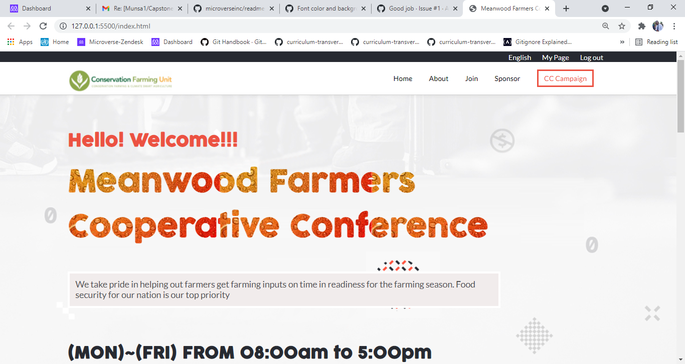

# Capstone Project

> This project is about.

Additional description about the project and its features.

## Built With

- HTML 5
- CSS 3
- Javascript Vanilla

## Live Demo

[Live Demo Link](https://munsa1.github.io/Capstone-Project/)

## Getting Started

To get a local copy up and running follow these simple example steps.

### Prerequisites

-Local machine web browser

### Setup

-clone the repository using (https://github.com/Munsa1/Capstone-Project)

### Install
-Any HTML text approved editor, etc. VS Code, Brackets, Atom

## Authors

👤 **Munsa Mibenge**

GitHub: [@Munsa1](https://github.com/munsa1)
- Twitter: [@twitterhandle](https://twitter.com/twitterhandle)
- LinkedIn: [LinkedIn](https://linkedin.com/in/linkedinhandle)

👤 **Author2**

- GitHub: [@githubhandle](https://github.com/githubhandle)
- Twitter: [@twitterhandle](https://twitter.com/twitterhandle)
- LinkedIn: [LinkedIn](https://linkedin.com/in/linkedinhandle)

## 🤝 Contributing

Contributions, issues, and feature requests are welcome!

Feel free to check the [issues page](../../issues/).

## Show your support

Give a ⭐️ if you like this project!

## Acknowledgments

- Hat tip to anyone whose code was used
- Inspiration
- etc

## 📝 License

This project is [MIT](./MIT.md) licensed.

